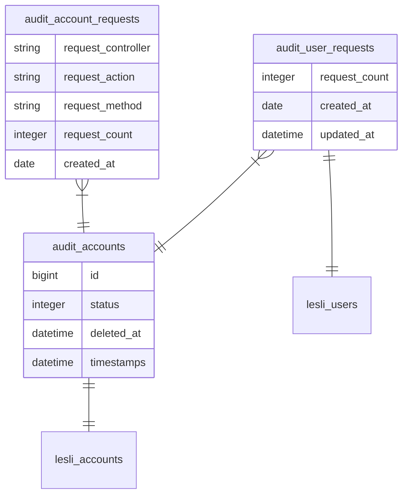

<p align="center">
    
</p>

<h3 align="center">Lesli Audit database</h3>

### 05.01. Audit
```plaintext
00.01. audit/account

05.01. audit/dashboards 

10.01. audit/logs
11.01. audit/account_requests
12.01. audit/user_requests
13.01. audit/devices

```


<fieldset>


</fieldset>
